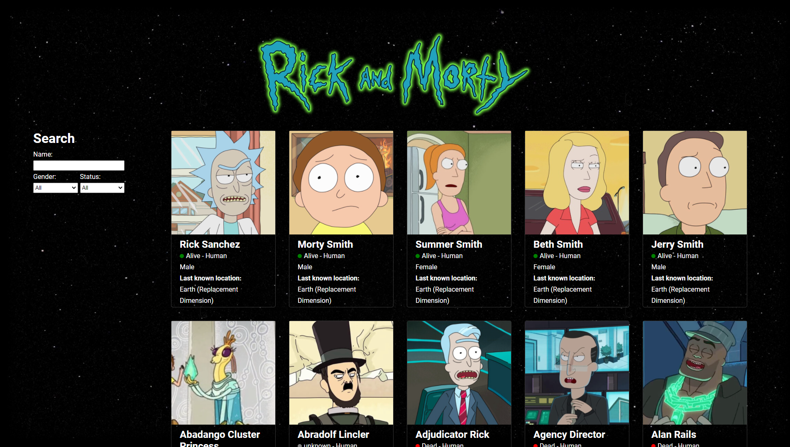

# Rick and Morty / Characters

This is a simple React project that shows Rick and Morty characters.



## Usage

```console
git clone https://github.com/huseyinsenkaya/rick-and-morty-wiki
```

```console
npm install
```
```console
npm start
```

